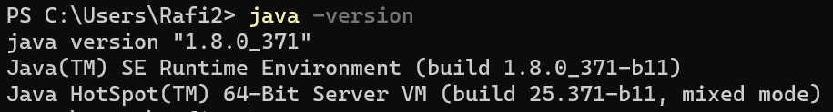
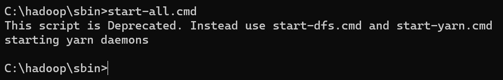
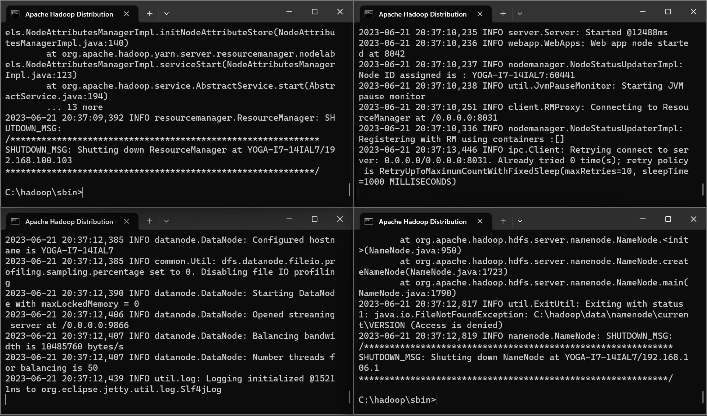
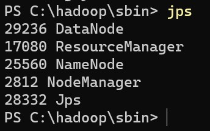

#### SBD Group E5:
- Lauren Christy 
- Rafi Fauzan
- Najwa Fathiadisa
- Mikhael Morris

  
# Hadoop_Word_Counter

WordCount adalah salah satu program contoh yang digunakan secara luas untuk memahami konsep pemrograman MapReduce pada Apache Hadoop. Program ini dirancang untuk melakukan perhitungan frekuensi kemunculan setiap kata dalam sejumlah besar dokumen teks.

# Langkah Instalasi Hadoop pada Windows

Berikut ini merupakan langkah-langkah yang dapat dilakukan untuk dapat melakukan instalasi Apache Hadoop pada 
sistem operasi Windows 11

### Langkah - Langkah:

**1. Melakukan Instalasi Java Versi 1.8.0**
untuk mengetahui apakah java telah terinstall pada perangkat anda, dapat menggunakan command "java -version"
<p align="center" width="100%">
     
</p>

**2. Melakukan Instalasi Apache Hadoop**
setelah melakukan instalasi terhadap Java versi 1.8.0, kemudian lakukan instalasi Apache Hadoop, kemudian extract
file zip instalasi nya yang akan disimpan di dalam directory C
<p align="center" width="100%">
     
</p>

**3. Menambahkan JAVA_HOME dan HADOOP_HOME pada environment variable**
membuat variabel environtment baru yang bernama JAVA_HOME dan HADOOP_HOME yang berisikan file bin masing-masing folder
<p align="center" width="100%">
     
</p>

**4. Melakukan konfiguras yang diperlukan untuk dapat menajalankan hadoop pada Windows**

**a. Konfiguurasi file hadoop-env**
tambahkan path yang sesuai untuk JAVA_HOME
<p align="center" width="100%">
     
</p>

**a. Konfiguurasi file hadoop-env**
tambahkan path yang sesuai untuk JAVA_HOME
<p align="center" width="100%">
    
</p>

untuk mengecek apakah JAVA_HOME sudah terkonfirasi dengan benar, gunakan command "hadoop" pada terminal
<p align="center" width="100%">
    
</p>

**b. Konfiguurasi file core-site.xml**
tambahkan konfigurasi berikut pada file tersebut
```
<configuration>
<property>
  <name>fs.defaultFS</name>
  <value>hdfs://localhost:9000</value>
 </property>
</configuration>
```
<p align="center" width="100%">
    
</p>

**c. Konfiguurasi file hdfs-site.xml**
tambahkan konfigurasi berikut pada file tersebut

```
<configuration>
 <property>
  <name>dfs.replication</name>
  <value>1</value>
 </property>
 <property>
  <name>dfs.namenode.name.dir</name>
  <value>C:\hadoop\data\namenode</value>
  <final>true</final>
 </property>
 <property>
  <name>dfs.datanode.data.dir</name>
  <value>C:\hadoop\data\datanode</value>
  <final>true</final>
 </property>
</configuration>
```

<p align="center" width="100%">
    
</p>

**d. Konfiguurasi file hdfs-site.xml**
sebelum mengkonfigurasikan file hdfs-site.xml, buatlah sebuah folder data yang berisi folder namenode dan folder datanode
<p align="center" width="100%">
    
</p>

tambahkan konfigurasi berikut pada file tersebut
```
<configuration>
 <property>
  <name>dfs.replication</name>
  <value>1</value>
 </property>
 <property>
  <name>dfs.namenode.name.dir</name>
  <value>C:\hadoop\data\namenode</value>
  <final>true</final>
 </property>
 <property>
  <name>dfs.datanode.data.dir</name>
  <value>C:\hadoop\data\datanode</value>
  <final>true</final>
 </property>
</configuration>
```
<p align="center" width="100%">
    
</p>

**e. Konfiguurasi file mapred-site.xml**
tambahkan konfigurasi berikut pada file tersebut
```
<configuration>
 <property>
  <name>mapreduce.framework.name</name>
  <value>yarn</value>
 </property>
</configuration>
```
<p align="center" width="100%">
    
</p>

**f. Konfiguurasi file yarn-site.xml**
tambahkan konfigurasi berikut pada file tersebut
```
<configuration>
 <property>
  <name>yarn.nodemanager.aux-services</name>
  <value>mapreduce_shuffle</value>
 </property>
 <property>
  <name>yarn.nodemanager.auxservices.mapreduce.shuffle.class</name>
  <value>org.apache.hadoop.mapred.ShuffleHandler</value>
 </property>
</configuration>
```
<p align="center" width="100%">
    
</p>

**g. Konfiguurasi file yarn-site.xml**
gunakan komen berikut untuk menjalankan Hadoop
```
start-all.cmd
```
<p align="center" width="100%">
    
</p>

setelah itu pastikan agar seluruh node berjalan dengan baik 
<p align="center" width="100%">
    
</p>

dapat juga menggunakan perintah:
```
jps
```
<p align="center" width="100%">
    
</p>


# Langkah Instalasi Hadoop pada Linux

1. Melakukan Instalasi OpenJDK di Ubuntu
   
   Gunakan command berikut untuk memperbarui sistem sebelum memulai instalasi baru:
   ```
   sudo apt update
   ```
2. Install OpenJDK 8

   Apache Hadoop 3.x sepenuhnya men-support Java 8. Gunakan command berikut untuk menginstall OpenJDK 8:
   ```
   sudo apt-get install openjdk-8-jdk
   ```
3. Verifikasi versi Java

   Setelah proses instalasi selesai, gunakan command berikut untuk verifikasi versi Java:
   ```
   java -version; javac -version
   ```
   Berikut adalah contoh output yang benar:
    
4. Set Up User Non-Root untuk environment Hadoop
   
   - Install OpenSSH di Ubuntu
     ```
     sudo apt install openssh-server openssh-client -y
     ```
     Berikut merupakan contoh output yang menunjukkan bahwa versi terbaru sudah ter-install
     

   - Membuat User Hadoop

     Gunakan command adduser untuk membuat pengguna Hadoop baru:
     ```
     sudo adduser hdoop
     ```
     Pada contoh diatas, username yang digunakan adalah hdoop, username dapat diubah sesuai dengan keinginan.
     Setelah itu, switch ke user yang baru saja dibuat dan buat password:
     ```
     su - hdoop
     ``` 
   - Enable Passwordless SSH untuk User Hadoop

     Untuk menghasilkan SSH key pair dan menentukan lokasi penyimmpanannya, gunakan command berikut
     ```
     ssh-keygen -t rsa -P '' -f ~/.ssh/id_rsa
     ```
     Berikut adalah contoh output yang benar:
     

     Gunakan command cat untuk menyimpan public key sebagai authorized_key di direktori ssh
     ```
     cat ~/.ssh/id_rsa.pub >> ~/.ssh/authorized_keys
     ```
        
     Gunakan command chmod mengatur permission untuk user
     ```
     chmod 0600 ~/.ssh/authorized_keys
     ```

     Lakukan verifikasi dengan menggunakan user hdoop untuk SSH ke localhost
     ```
     ssh localhost
     ```
     
   - Download and Install Hadoop on Ubuntu

     Download Hadoop sesuai versi yang diinginkan dari [Apache Hadoop Project Page](https://hadoop.apache.org/releases.html)
     Tutorial ini akan menggunakan Binary download untuk Hadoop Version 3.2.1.

     Gunakan mirror link yang disediakan setelah memilih versi dan download Hadoop tar package dengan command wget:
     ```
     wget https://downloads.apache.org/hadoop/common/hadoop-3.2.1/hadoop-3.2.1.tar.gz
     ```
     Berikut contoh penggunaan command wget
     
     
     Setelah itu, ekstrak file yang sudah di-download dengan command berikut:
     ```
     tar xzf hadoop-3.2.1.tar.gz
     ```
     
6. Single Node Hadoop Deployment (Pseudo-Distributed Mode)   
   Hadoop berfungsi dengan baik ketika diterapkan dalam Multi Node. Namun, jika baru mengenal Hadoop dan ingin menjelajahi perintah dasar atau menguji aplikasi,
   konfigurasi dapat dilakukan dengan single node.
   Mode ini disebut sebagai Pseudo-Distributed Mode, memungkinkan setiap daemon Hadoop berjalan sebagai satu proses Java tunggal. Environment Hadoop
   dikonfigurasi dengan mengedit beberapa file konfigurasi: 
   bashrc
   hadoop-env.sh
   core-site.xml
   hdfs-site.xml
   mapred-site-xml
   yarn-site.xml

   - Konfigurasi Variabel Environment Hadoop (bashrc)

     Edit file konfigurasi shell .bashrc dengan text editor (dalam contoh ini digunakan nano):
     ```
     sudo nano .bashrc
     ```

     Tentukan variabel environment Hadoop dengan menambahkan konten berikut ke akhir file:
     ```
     #Hadoop Related Options
     export HADOOP_HOME=/home/hdoop/hadoop-3.2.1
     export HADOOP_INSTALL=$HADOOP_HOME
     export HADOOP_MAPRED_HOME=$HADOOP_HOME
     export HADOOP_COMMON_HOME=$HADOOP_HOME
     export HADOOP_HDFS_HOME=$HADOOP_HOME
     export YARN_HOME=$HADOOP_HOME
     export HADOOP_COMMON_LIB_NATIVE_DIR=$HADOOP_HOME/lib/native
     export PATH=$PATH:$HADOOP_HOME/sbin:$HADOOP_HOME/bin
     export HADOOP_OPTS"-Djava.library.path=$HADOOP_HOME/lib/nativ"
     ```

     Setelah melakukan save terhadap file, kita harus menerapkan perubahan ke environment yang sedang berjalan saat ini dengan menggunakan command berikut
     ```
     source ~/.bashrc
     ```
     
   - Edit file hadoop-env.sh

     File hadoop-env.sh berfungsi sebagai file utama untuk mengonfigurasi pengaturan YARN, HDFS, MapReduce, dan proyek terkait Hadoop. Ketika mengatur cluster Hadoop satu 
     node, kita perlu mendefinisikan implementasi Java yang akan digunakan. Gunakan variabel $HADOOP_HOME yang telah dibuat sebelumnya untuk mengakses file hadoop-env.sh:
     ```
     sudo nano $HADOOP_HOME/etc/hadoop/hadoop-env.shCopied!
     ```

     Uncomment tanda # pada variabel $JAVA_HOME dan tambahkan path ke instalasi OpenJDK di sistem Anda. Jika Anda telah menginstall versi yang sama seperti yang                ditampilkan pada bagian pertama tutorial ini, tambahkan baris berikut:
     ```
     export JAVA_HOME=/usr/lib/jvm/java-8-openjdk-amd64
     ```
     
     Path tersebut harus sesuai dengan lokasi instalasi Java pada sistem Anda:
     
     
     Untuk mengetahui Java path yang benar, run command berikut pada terminal
     ```
     which javac
     ```

     Output yang dihasilkan adalah path ke direktori Java binary
     

     Gunakan path tersebut untuk menemukan direktori OpenJDK dengan command berikut
     ```
     readlink -f /usr/bin/javac
     ```
     Bagian dari path tepat sebelum direktori /bin/javac harus ditetapkan sebagai variabel $JAVA_HOME.
     

   - Edit core-site.xml File 

     File core-site.xml mendefinisikan properti HDFS dan inti Hadoop.
     Untuk mengatur Hadoop dalam mode pseudo-terdistribusi, kita perlu menentukan URL untuk NameNode kita dan direktori sementara yang digunakan oleh Hadoop untuk proses
     map dan reduce.

     Buka file core-site.xml dengan text editor:
     ```
     sudo nano $HADOOP_HOME/etc/hadoop/core-site.xml
     ```
     Tambahkan konfigurasi berikut untuk mengganti nilai default dari direktori sementara dan tambahkan URL HDFS untuk menggantikan pengaturan sistem file lokal
     default:
     ```
     <configuration>
     <property>
       <name>hadoop.tmp.dir</name>
       <value>/home/hdoop/tmpdata</value>
     </property>
     <property>
       <name>fs.default.name</name>
       <value>hdfs://127.0.0.1:9000</value>
     </property>
     </configuration>
     ```

     Contoh ini menggunakan value berdasarkan sistem lokal. Kita harus menggunakan value yang sesuai dengan sistem masing-masing, dan data harus
     konsisten selama proses konfigurasi.
     

   - Edit hdfs-site.xml File 

     Properti dalam file hdfs-site.xml mengatur lokasi penyimpanan metadata node, file fsimage, dan file edit log. Konfigurasikan file tersebut dengan menentukan
     direktori penyimpanan NameNode dan DataNode.
     Selain itu, nilai default dfs.replication yang awalnya 3 perlu diubah menjadi 1 agar sesuai dengan pengaturan node tunggal.
     Gunakan command berikut untuk membuka file hdfs-site.xml untuk diedit:
     ```
     sudo nano $HADOOP_HOME/etc/hadoop/hdfs-site.xml
     ```

     Tambahkan konfigurasi berikut ke dalam file tersebut, dan jika diperlukan, sesuaikan direktori NameNode dan DataNode sesuai dengan lokasi:
     ```
     <configuration>
     <property>
       <name>dfs.data.dir</name>
       <value>/home/hdoop/dfsdata/namenode</value>
     </property>
     <property>
       <name>dfs.data.dir</name>
       <value>/home/hdoop/dfsdata/datanode</value>
     </property>
     <property>
       <name>dfs.replication</name>
       <value>1</value>
     </property>
     </configuration>
     ```
     Jika diperlukan, buat direktori khusus untuk nilai dfs.data.dir.
     

   - Edit mapred-site.xml File    

     Gunakan command berikut untuk mengakses file mapred-site.xml
     ```
     sudo nano $HADOOP_HOME/etc/hadoop/mapred-site.xml
     ```
     Tambahkan konfigurasi berikut untuk mengubah value default MapReduce framework ke yarn:
     ```
     <configuration>
     <property>
       <name>mapreduce.framework.name</name>
       <value>yarn</value>
     </property>
     </configuration>
     ```
     

   - Edit yarn-site.xml File    

     File yarn-site.xml digunakan untuk mendefinisikan pengaturan yang relevan dengan YARN. File ini berisi konfigurasi untuk Node Manager, Resource Manager, Kontainer,
     dan Application Master. Gunakan command berikut untuk mengakses file yarn-site.xml:
     ```
     sudo nano $HADOOP_HOME/etc/hadoop/yarn-site.xml
     ```
     Tambahkan konfigurasi berikut dalam file:
     ```
     <configuration>
     <property>
       <name>yarn.nodemanager.aux-services</name>
       <value>mapreduce_shuffle</value>
     </property>
     <property>
       <name>yarn.nodemanager.aux-services.mapreduce.shuffle.class</name>
       <value>org.apache.hadoop.mapred.ShuffleHandler</value>
     </property>
     <property>
       <name>yarn.resourcemanager.hostname</name>
       <value>127.0.0.1</value>
     </property>
     <property>
       <name>yarn.acl.enable</name>
       <value>0</value>
     </property>
     <property>
       <name>yarn.nodemanager.env-whitelist</name>   
       <value>JAVA_HOME,HADOOP_COMMON_HOME,HADOOP_HDFS_HOME,HADOOP_CONF_DIR,CLASSPATH_PERPEND_DISTCACHE,HADOOP_YARN_HOME,HADOOP_MAPRED_HOME</value>
     </property>
     </configuration>
     ```     
     

7. Format HDFS NameNode

   Penting untuk melakukan format pada NameNode sebelum menggunakan Hadoop untuk pertama kalinya
   ```
   hdfs namenode -format
   ```
   Notifikasi shutdown menandakan akhir dari proses format NameNode
   

9. Start Hadoop Cluster

   Akses direktori hadoop-3-2.1/sbin dan run command berikut untuk start NameNode dan DataNode:
   ```
   ./start-dfs.sh
   ```
   

   Setelah namenode, datanode, dan secondary namenode berjalan, start YARN resource dan nodemanagers dengan command berikut:
   ```
   ./start-yarn.sh
   ```
   

   Gunakan command berikut untuk memeriksa apakah semua daemon aktif dan running sebagai proses Java:
   ```
   jps
   ```
   

10. Akses Hadoop UI dari browser

   Gunakan browser dan navigate ke localhost URL or IP. Nomor port default 9870 memberikan akses ke UI Hadoop NameNode.
   ```
   http://localhost:9870
   ```
   UI NameNode menyediakan gambaran menyeluruh dari kluster.
   

   Default port 9864 bermanfaat untuk mengakses individual DataNodes secara langsung dari browser
   ```
   http://localhost:9864
   ```
   
   
   YARN Resource Manager dapat diakses dari port 8088
   ```
   http://localhost:8088
   ```
   Resource Manager bermanfaat untuk memonitor semua running process dalam Hadoop cluster
   

