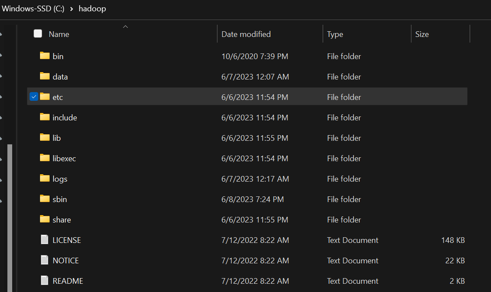
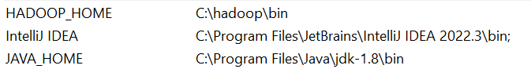
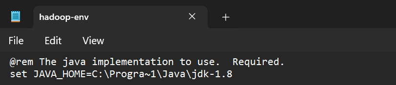
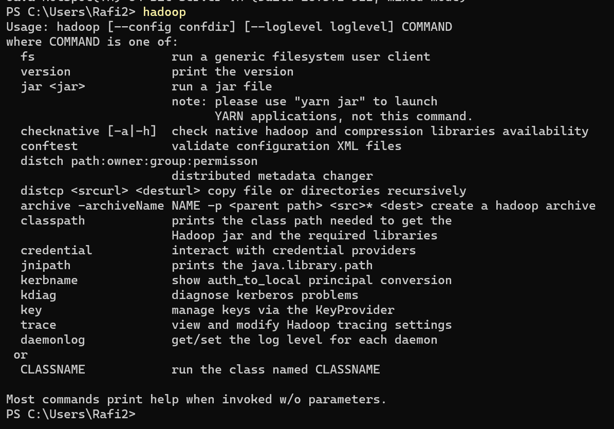
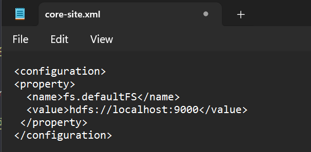
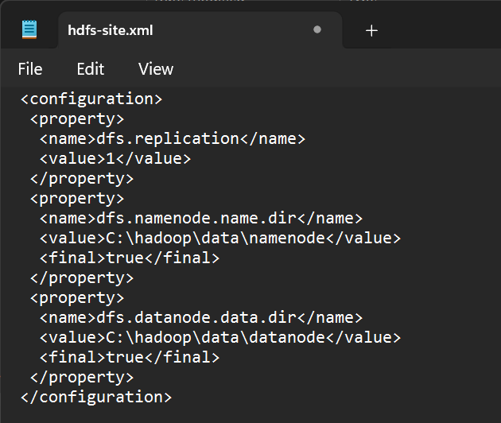
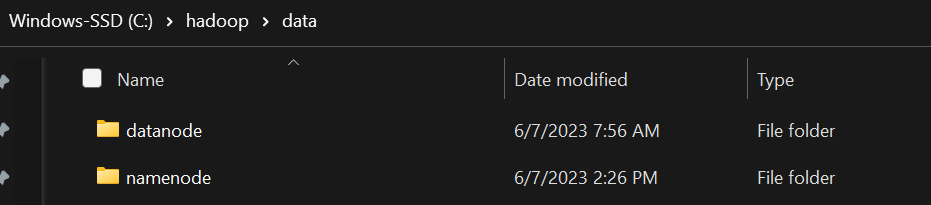
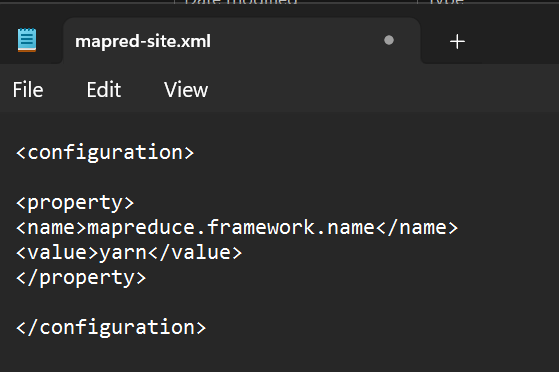
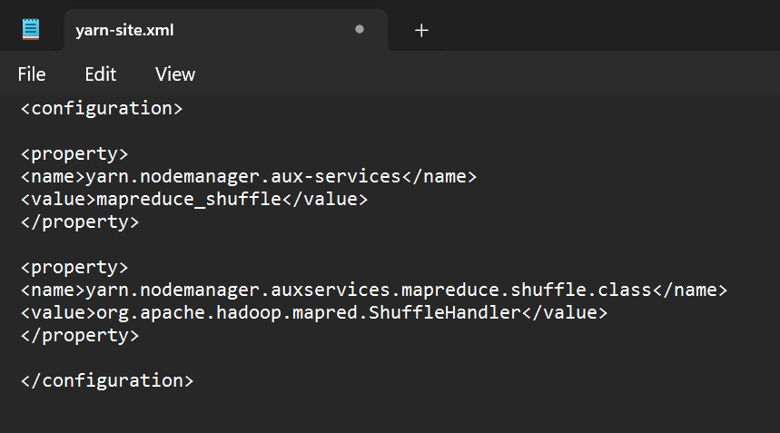

# Hadoop_Word_Counter

WordCount adalah salah satu program contoh yang digunakan secara luas untuk memahami konsep pemrograman MapReduce pada Apache Hadoop. Program ini dirancang untuk menghitung frekuensi kemunculan setiap kata dalam sejumlah besar dokumen teks.

# Langkah Instalasi Hadoop pada Windows

Berikut ini merupakan langkah-langkah yang dapat dilakukan untuk dapat melakukan instalasi Apache Hadoop pada 
sistem operasi Windows 11

### Langkah - Langkah:

**1. Melakukan Instalasi Java Versi 1.8.0**
untuk mengetahui apakah java telah terinstall pada perangkat anda, dapat menggunakan command "java -version"

     

**2. Melakukan Instalasi Apache Hadoop**
setelah melakukan instalasi terhadap Java versi 1.8.0, kemudian lakukan instalasi Apache Hadoop, kemudian extract
file zip instalasi nya yang akan disimpan di dalam directory C

     

**3. Menambahkan JAVA_HOME dan HADOOP_HOME pada environment variable**
membuat variabel environtment baru yang bernama JAVA_HOME dan HADOOP_HOME yang berisikan file bin masing-masing folder

     

**4. Melakukan konfiguras yang diperlukan untuk dapat menajalankan hadoop pada Windows**

**a. Konfiguurasi file hadoop-env**
tambahkan path yang sesuai untuk JAVA_HOME

     

**a. Konfiguurasi file hadoop-env**
tambahkan path yang sesuai untuk JAVA_HOME

    

untuk mengecek apakah JAVA_HOME sudah terkonfirasi dengan benar, gunakan command "hadoop" pada terminal

    

**b. Konfiguurasi file core-site.xml**
tambahkan konfigurasi berikut pada file tersebut
<!--
<configuration>
<property>
  <name>fs.defaultFS</name>
  <value>hdfs://localhost:9000</value>
 </property>
</configuration>
-->

    

**c. Konfiguurasi file hdfs-site.xml**
tambahkan konfigurasi berikut pada file tersebut
<!--
<configuration>
 <property>
  <name>dfs.replication</name>
  <value>1</value>
 </property>
 <property>
  <name>dfs.namenode.name.dir</name>
  <value>C:\hadoop\data\namenode</value>
  <final>true</final>
 </property>
 <property>
  <name>dfs.datanode.data.dir</name>
  <value>C:\hadoop\data\datanode</value>
  <final>true</final>
 </property>
</configuration>
-->

    

**d. Konfiguurasi file hdfs-site.xml**
sebelum mengkonfigurasikan file hdfs-site.xml, buatlah sebuah folder data yang berisi folder namenode dan folder datanode

    

tambahkan konfigurasi berikut pada file tersebut
<!--
<configuration>
 <property>
  <name>dfs.replication</name>
  <value>1</value>
 </property>
 <property>
  <name>dfs.namenode.name.dir</name>
  <value>C:\hadoop\data\namenode</value>
  <final>true</final>
 </property>
 <property>
  <name>dfs.datanode.data.dir</name>
  <value>C:\hadoop\data\datanode</value>
  <final>true</final>
 </property>
</configuration>
-->

    

**e. Konfiguurasi file mapred-site.xml**
tambahkan konfigurasi berikut pada file tersebut
<!--
<configuration>
<property>
<name>mapreduce.framework.name</name>
<value>yarn</value>
</property>
</configuration>
-->

    

**f. Konfiguurasi file yarn-site.xml**
tambahkan konfigurasi berikut pada file tersebut
<!--
<configuration>

<property>
<name>yarn.nodemanager.aux-services</name>
<value>mapreduce_shuffle</value>
</property>

<property>
<name>yarn.nodemanager.auxservices.mapreduce.shuffle.class</name>
<value>org.apache.hadoop.mapred.ShuffleHandler</value>
</property>

</configuration>

-->

    

